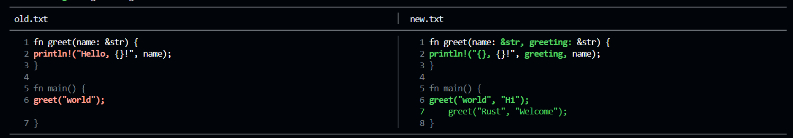

<div align="center">

# ⚡ difftastic-mini

**A `diff` replacement that shows exactly what changed — word by word, side by side**

*Not just which line changed. Which word.*

[](https://github.com/siyad01/difftastic-mini/actions/workflows/build.yml)
[](LICENSE)
[](Cargo.toml)
[](#)
[](#install)
[](#install)

</div>

---

## Why difftastic-mini exists

`diff` has been the standard since 1974. It tells you a line changed.  
It does not tell you what changed *inside* the line.

`git diff` has the same limitation. When you rename a parameter, fix a typo, or reorder arguments — you get the entire line highlighted red and green. You have to read both lines yourself and spot the difference.

For a one-word change in a 60-character line, that is noise, not signal.

**difftastic-mini** runs a second Myers diff pass inside every changed line.  
You see exactly which words moved — bold red on the left, bold green on the right.  
Everything else stays white.

---

## What it looks like



```text
────────────────────────────────────────────────────────────────────────────────
 old.txt                               │  new.txt
────────────────────────────────────────────────────────────────────────────────
  1 fn greet(name: &str) {             │   1 fn greet(name: &str, greeting: &str) {
  2     println!("Hello, {}!", name);  │   2     println!("{}, {}!", greeting, name);
  3 }                                  │   3 }
  4                                    │   4
  5 fn main() {                        │   5 fn main() {
  6     greet("world");                │   6     greet("world", "Hi");
                                       │   7     greet("Rust", "Welcome");
  7 }                                  │   8 }
────────────────────────────────────────────────────────────────────────────────
```

Changed words are **bold** — red on the left (removed), green on the right (added).  
Equal words stay white. Line numbers track both files independently.  
The separator stays fixed regardless of line length.

---

## Install

```bash
git clone https://github.com/siyad01/difftastic-mini
cd difftastic-mini
cargo build --release
cp target/release/difftastic-mini ~/.local/bin/
```

Verify:

```bash
difftastic-mini --help
```

No runtime required. Single static binary. Works on WSL2, Linux, macOS, and Windows.

---

## Quick start

```bash
# Side-by-side with color (default)
difftastic-mini old.txt new.txt

# Disable color — safe for piping and CI logs
difftastic-mini --no-color old.txt new.txt > diff.txt

# Wider panels
difftastic-mini --width=80 old.txt new.txt

# Unified +/- format, still word-aware
difftastic-mini --unified old.txt new.txt

# Combine flags
difftastic-mini --no-color --unified old.txt new.txt
```

---

## Flags

| Flag | Default | Description |
|------|---------|-------------|
| `--no-color` | color on | Disable ANSI colors |
| `--width=N` | 60 | Panel width per side in characters (min 20) |
| `--unified` | off | Unified +/- format instead of side-by-side |

---

## Use as a git difftool

```bash
git config --global diff.tool difftastic-mini
git config --global difftool.difftastic-mini.cmd 'difftastic-mini "$LOCAL" "$REMOTE"'
git config --global difftool.prompt false
```

Then in any git repo:

```bash
git difftool HEAD~1 HEAD
```

---

## How it works

```text
difftastic-mini old.txt new.txt
         │
         ▼
┌─────────────────────────────────────────┐
│            config.rs                    │
│  Parses flags → builds Config struct    │
│  Validates paths → exits cleanly        │
└──────────────────┬──────────────────────┘
                   │
                   ▼
┌─────────────────────────────────────────┐
│            reader.rs                    │
│  Reads both files → Vec<String> lines   │
│  Handles empty files, missing files     │
└──────────────────┬──────────────────────┘
                   │
                   ▼
┌─────────────────────────────────────────┐
│             diff.rs                     │
│                                         │
│  Pass 1: Myers diff on lines            │
│  → Equal / Deleted / Inserted / Changed │
│                                         │
│  Pass 2: Myers diff on words            │
│  → inside every Changed line            │
│  → WordDiff: Equal / Deleted / Inserted │
└──────────────────┬──────────────────────┘
                   │
         ┌─────────┴─────────┐
         ▼                   ▼
  Side-by-side           Unified
  renderer               renderer
  (default)              (--unified)
         │                   │
         └─────────┬─────────┘
                   ▼
            render.rs
   crossterm colors + fixed-width panels
```

### Why two diff passes

Every other terminal diff tool stops at the line level.  
A line is either added, removed, or unchanged.

difftastic-mini detects *Changed* lines — lines that exist in both files but with different content — and runs Myers diff again on the individual words inside them. This is the second pass that produces the word-level highlighting.

---

## Comparison

| Tool            | Side-by-side | Word-level | Color | Single binary |
|-----------------|:------------:|:----------:|:-----:|:-------------:|
| diff            | ❌           | ❌         | ❌    | ✅            |
| git diff        | ❌           | ❌         | ✅    | ❌            |
| difftastic      | ✅           | ✅         | ✅    | ❌            |
| difftastic-mini | ✅           | ✅         | ✅    | ✅            |

---

## Project structure

```text
difftastic-mini/
├── src/
│   ├── main.rs       ← CLI entry point, orchestrates all modules
│   ├── config.rs     ← parses flags into a Config struct
│   ├── reader.rs     ← reads files from disk into memory
│   ├── diff.rs       ← Myers diff (via similar) → Vec<DiffLine> + 8 tests
│   ├── render.rs     ← side-by-side and unified terminal output
│   └── types.rs      ← shared data types: DiffLine, WordDiff, FileContent
├── Cargo.toml
└── README.md
```

---

## Built with

- [Rust 1.95](https://www.rust-lang.org/) — zero runtime, single static binary, 655KB
- [similar 2.7](https://github.com/mitsuhiko/similar) — Myers diff, the same library cargo itself uses internally
- [crossterm 0.28](https://github.com/crossterm-rs/crossterm) — terminal colors, works on WSL2, Linux, macOS, and Windows

---

## Known limitations

- Word splitting is whitespace-based. Punctuation-aware tokenization would improve diffs inside expressions like `greet(name:` → `greet(name:, greeting:`.
- No recursive directory diff (`diff -r` equivalent) yet.
- Binary file detection is not implemented — pass text files only.

---

## Roadmap

- [ ] Punctuation-aware word tokenization
- [ ] Directory diff support (`difftastic-mini dir1/ dir2/`)
- [ ] Binary file detection with clear error message
- [ ] `--context=N` flag to show N lines around changes
- [ ] Syntax-aware diffing (don't split inside string literals)
- [ ] `cargo install` support

---

## Contributing

See [CONTRIBUTING.md](CONTRIBUTING.md) for development setup, coding style, and pull request guidelines.

---

## License

MIT — see [LICENSE](LICENSE)

---

<div align="center">

Built with Rust · 655KB binary · Zero runtime dependencies · Works everywhere

**If you've ever stared at a red line and a green line trying to spot the difference, this is the fix. Give it a ⭐**

</div>